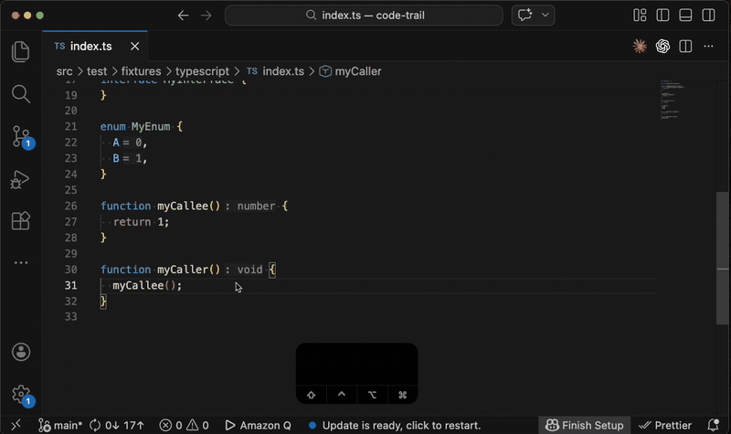

# Code Trail

A VS Code extension for recording code reading notes.

## Features

- Save code snippets as Markdown notes ("marks") with YAML frontmatter
  - Automatically detects the symbol (function, class, method, interface, enum, const, etc.) at cursor position
  - Records file path, line range, symbol name, symbol kind, timestamp, GitHub URL, and the selected code
- Link marks to each other with `uses`/`usedBy` relationships, with call hierarchy suggestions
- Clickable `code-trail:` links to jump between marks and source code
- Add title nodes to organize and label groups of marks in the graph
- Visualize marks as a directed graph
  - Nodes show code snippets with file path and line range
  - Title nodes display with a larger bold font
  - Click a node to expand/collapse code
  - Ctrl/Cmd+Click a node to open mark file

## Commands

| Command                  | Keybinding     | Description                                |
| ------------------------ | -------------- | ------------------------------------------ |
| `Code Trail: Mark Code`  | `Ctrl+Shift+M` | Mark the selected code or symbol at cursor |
| `Code Trail: Link Mark`  | `Ctrl+Shift+L` | Link the current mark to another mark      |
| `Code Trail: Show Graph` | `Ctrl+Shift+G` | Show the mark graph in a Webview panel     |
| `Code Trail: Add Title`  | `Ctrl+Shift+T` | Add a title node to the graph              |

## Usage

1. Select code in the editor (or place cursor inside a function/method)
2. Run `Code Trail: Mark Code` to save code snipets as Markdown notes ("marks")
3. Open a mark file and run `Code Trail: Link Mark` to create relationships between marks
4. Run `Code Trail: Show Graph` to visualize the relationships
